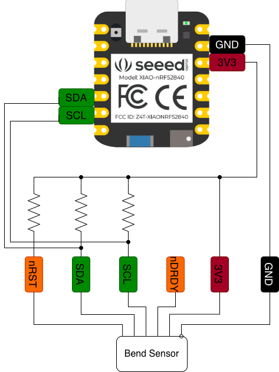

# Thermal Brush Hardware

Here, we describe the hardware configuration of Thermal Brush, a brush that detects its stroke direction and the color being painted in real-time.
For the heater hardware configuration, please refer to our papers (1, 2) as well as [the author's website](https://sosuke-ichihashi.com/thermoblinds/).

## Brush
The brush can be anything as long as you can fix a bend sensor and a webcam to it.
In our example, we used a [2.5" brush](https://a.co/d/09egNIkl). Our 3D models of the sensor&camera mounts are for this specific brush, so please get this if you want to use our attachments.
If you are comfortable with CAD or are ok with fixing the components using more manual ways (e.g., hot glue), please feel free to pick whatever brush you want.

## Microcontroller
We have tried two microcontroller options: Arduino (wired) and [Xiao nrf52840](https://wiki.seeedstudio.com/XIAO_BLE/) (BLE).
The wired connection gives you more seamless integration of the color and heat thanks to its smaller latency.
The BLE gives you more comfortable painting experience by eliminating sensor lines between the brush and PC.
The software on this repo is the one for BLE. If you want to use a wired connection, please contact pengu1n.i843@gmail or make a new issue on this repo.

## Bend Sensor
We have tried two bend sensor options: [typical resistance-based bend sensor](https://www.adafruit.com/product/182) and [Bend Labs waterproof bend sensor](https://www.digikey.com/short/fcwhv7dz).
We highly recommend the Bend Labs sensor because it is waterproof and measures bendings in both directions.
If you use a typical resistance-based bend sensor, you need to use two of them to detect both right and left strokes. Then, you need to apply [waterproof flexible polymer](https://a.co/d/00INWjTv) on them, which is pretty labor-heavy.
The software on this repo is the one for the Bends Labs sensor, which communicates with the Xiao microcontroller via I2C.

## Webcam
You can use pretty much any webcam.
The attachment 3D model we provided is for [Logitech C270](https://a.co/d/01MAVrKs).
If your PC is connected to multiple cameras including the built-in one, you need to update the index in the code so the opencv can access the camera mounted on the brush.

## Wiring

